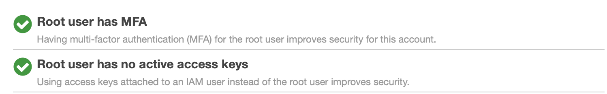
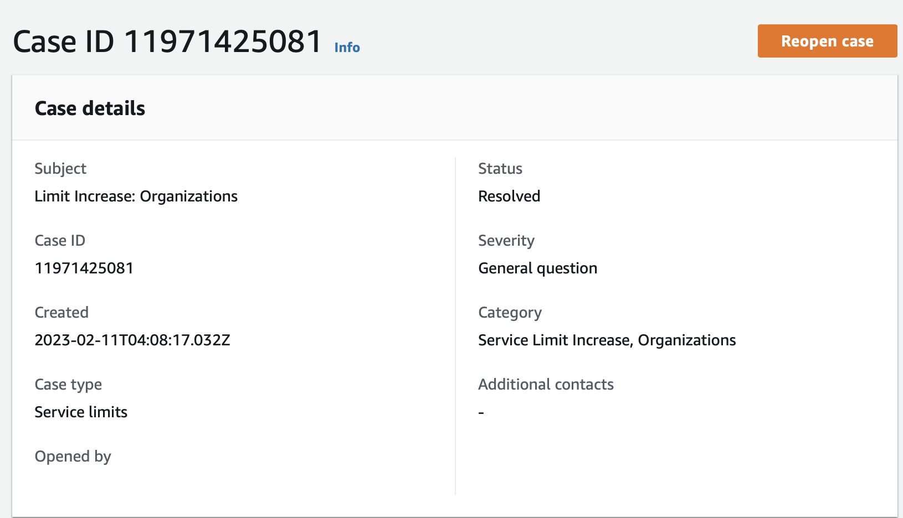

# Week 0 — Billing and Architecture

## Instructional Completion   
| TASK | COMPLETED |
|  --- |    ---    |
| Watched Live - Streamed Video | :heavy_check_mark: |
| Watched Chirag's - Spend Considerations   | :heavy_check_mark: |
| Watched Ashish's - Security Considerations | :heavy_check_mark: |
| Recreate Conceptual Diagram in Lucid Charts or on a Napkin | :heavy_check_mark: |
| Recreate Logical Architectual Diagram in Lucid Charts | :heavy_check_mark: |
| Create an Admin User | :heavy_check_mark: |
| Use CloudShell | :heavy_check_mark: |
| Generate AWS Credentials | :heavy_check_mark: |
| Installed AWS CLI | :heavy_check_mark: |
| Create a Billing Alarm | :heavy_check_mark: |
| Create a Budget | :heavy_check_mark: |

## Homework Challenges Completion

| TASK | COMPLETED |
|  --- |    ---    |
| Destroy your root account credentials, Set MFA, IAM role | :heavy_check_mark: |
| Use EventBridge to hookup Health Dashboard to SNS and send notification when there is a service health issue | :heavy_check_mark: See Homework Challenge notes|
| Review all the questions of each pillars in the Well Architected Tool (No specialized lens) | :heavy_check_mark: See Homework Challenge notes|
| Create an architectural diagram (to the best of your ability) the CI/CD logical pipeline in Lucid Charts | :heavy_check_mark: See Homework Challenge notes|
| Research the technical and service limits of specific services and how they could impact the technical path for technical flexibility | :heavy_check_mark:  See Homework Challenge notes|
| Open a support ticket and request a service limit | :heavy_check_mark:  |

### Homework Challenge notes

For Architecture pillars:

Making use of AWS Organizations with environment based OUs so it would be easier to do audits based on accounts, each OU has an central account that member accounts can assume roles to so all access permissions can be controled by editing permissions within the OU central account.

Making use of API Gateway so the architecture could be more flexible when we need to add new serviecs that may not be in python under the same API and Coginto for easier implementation of authentication

Originally wanted to use DynamoDB TTL to simplify implementing ephemeral messaging feature, realized it only offers precision to the hour but not minutes precision so looked into EventBridge. Turns out EventBridge does support precision down to the minutes. AppSync allows lambda resolvers so we could schedule a job with a expire timestamp of the message when creating the mutation event.

Had concern about AWS Organization allowing only 1 account to enjoy the Free tier benefits, but realized with the ECS free tier and other services free tier quota the team should be fine. If free tier is not enough for the AWS Organization we could each share our resources through RAM to pool them together but the architecture would be unnecessarily complex. All resources used in the [design](https://lucid.app/documents/view/f7e59b81-605f-4131-af03-1657c3f03f6e) has free tier quota


## Notes
### Install AWS CLI in GitPod
Update our `.gitpod.yml` to include the following task.

```sh
tasks:
  - name: aws-cli
    env:
      AWS_CLI_AUTO_PROMPT: on-partial
    init: |
      cd /workspace
      curl "https://awscli.amazonaws.com/awscli-exe-linux-x86_64.zip" -o "awscliv2.zip"
      unzip awscliv2.zip
      sudo ./aws/install
      cd $THEIA_WORKSPACE_ROOT
```

### Create a new User and Generate AWS Credentials
Done through ClickOps on AWS Management Console
### Set Env Vars

We will set these credentials for the current bash terminal
```
export AWS_ACCESS_KEY_ID=""
export AWS_SECRET_ACCESS_KEY=""
export AWS_DEFAULT_REGION=us-east-1
```

We'll tell Gitpod to remember these credentials if we relaunch our workspaces
```
gp env AWS_ACCESS_KEY_ID=""
gp env AWS_SECRET_ACCESS_KEY=""
gp env AWS_DEFAULT_REGION=us-east-1
```

### Check that the AWS CLI is working and you are the expected user

```sh
aws sts get-caller-identity
```

You should see something like this:
```json
{
    "UserId": "AIFBZRJIQN2ONP4ET4EK4",
    "Account": "655602346534",
    "Arn": "arn:aws:iam::655602346534:user/andrewcloudcamp"
}
```

## Enable Billing 

We need to turn on Billing Alerts to recieve alerts...


- In your Root Account go to the [Billing Page](https://console.aws.amazon.com/billing/)
- Under `Billing Preferences` Choose `Receive Billing Alerts`
- Save Preferences


## Creating a Billing Alarm

### Create SNS Topic

- We need an SNS topic before we create an alarm.
- The SNS topic is what will delivery us an alert when we get overbilled
- [aws sns create-topic](https://docs.aws.amazon.com/cli/latest/reference/sns/create-topic.html)

We'll create a SNS Topic
```sh
aws sns create-topic --name billing-alarm
```
which will return a TopicARN

We'll create a subscription supply the TopicARN and our Email
```sh
aws sns subscribe \
    --topic-arn TopicARN \
    --protocol email \
    --notification-endpoint your@email.com
```

Check your email and confirm the subscription

#### Create Alarm

- [aws cloudwatch put-metric-alarm](https://docs.aws.amazon.com/cli/latest/reference/cloudwatch/put-metric-alarm.html)
- [Create an Alarm via AWS CLI](https://aws.amazon.com/premiumsupport/knowledge-center/cloudwatch-estimatedcharges-alarm/)
- We need to update the configuration json script with the TopicARN we generated earlier
- We are just a json file because --metrics is is required for expressions and so its easier to us a JSON file.

```sh
aws cloudwatch put-metric-alarm --cli-input-json file://aws/json/alarm_config.json
```

## Create an AWS Budget

[aws budgets create-budget](https://docs.aws.amazon.com/cli/latest/reference/budgets/create-budget.html)

Get your AWS Account ID
```sh
aws sts get-caller-identity --query Account --output text
```

- Supply your AWS Account ID
- Update the json files
- This is another case with AWS CLI its just much easier to json files due to lots of nested json

```sh
aws budgets create-budget \
    --account-id AccountID \
    --budget file://aws/json/budget.json \
    --notifications-with-subscribers file://aws/json/budget-notifications-with-subscribers.json
```