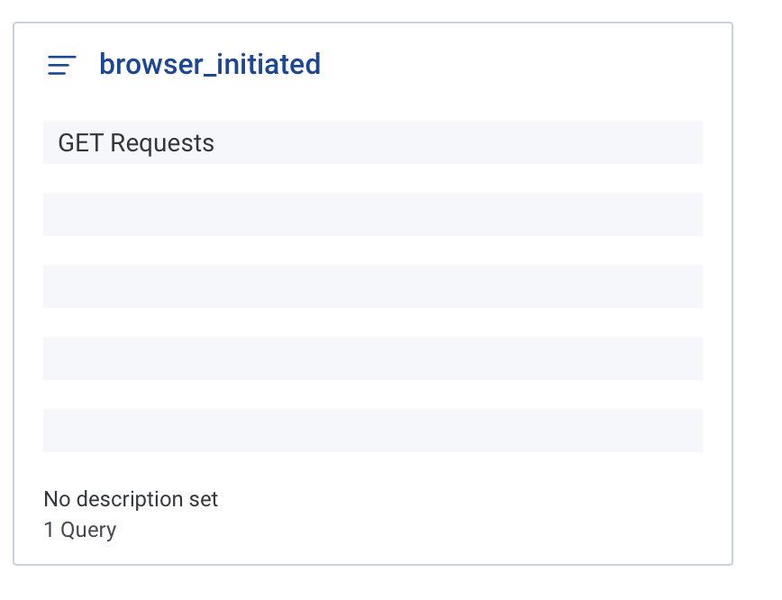

# Week 2 — Distributed Tracing

## Homework

| TASK | COMPLETED |
|  --- |    ---    |
| Watch Week 2 Live-Stream Video | :heavy_check_mark: |
| Watch Chirag Week 2 - Spending Considerations | :heavy_check_mark: |
| Watched Ashish's Week 2 - Observability Security Considerations | :heavy_check_mark: |
| Instrument Honeycomb with OTEL | :heavy_check_mark: |
| Instrument AWS X-Ray | :heavy_check_mark: |
| Instrument AWS X-Ray Subsegments | :heavy_check_mark: |
| Configure custom logger to send to CloudWatch Logs | :heavy_check_mark: |
| Integrate Rollbar and capture and error | :heavy_check_mark: |


## Notes

### For local development without Gitpods(all credits used up) setup

Add the following to the `requirements.txt`

```
python-dotenv
```

Create `.env` file and put all the environment variables there

```
ENV_VARIABLE_1="VALUE"
ENV_VARIABLE_2="VALUE"
ENV_VARIABLE_3="VALUE"
ENV_VARIABLE_4="VALUE"
```

Create `env.py` file where `app.py` resides in the project

```
import os
from dotenv import load_dotenv

load_dotenv()

ENV_VARIABLE_1 = os.getenv('ENV_VARIABLE_1')
ENV_VARIABLE_2 = os.getenv('ENV_VARIABLE_1')
ENV_VARIABLE_3 = os.getenv('ENV_VARIABLE_1')
```

Then import the `env.py` into your `app.py`

```
# top of app.py file
from env import *
```

### HoneyComb

Add the following to the `requirements.txt`

```
opentelemetry-api 
opentelemetry-sdk 
opentelemetry-exporter-otlp-proto-http 
opentelemetry-instrumentation-flask 
opentelemetry-instrumentation-requests
```

Install the depedencies

```
pip install -r requirements.txt
```

Add to the `app.py`

```
from opentelemetry import trace
from opentelemetry.instrumentation.flask import FlaskInstrumentor
from opentelemetry.instrumentation.requests import RequestsInstrumentor
from opentelemetry.exporter.otlp.proto.http.trace_exporter import OTLPSpanExporter
from opentelemetry.sdk.trace import TracerProvider
from opentelemetry.sdk.trace.export import BatchSpanProcessor
```

```
# Initialize tracing and an exporter that can send data to Honeycomb
provider = TracerProvider()
processor = BatchSpanProcessor(OTLPSpanExporter())
provider.add_span_processor(processor)

# Could use a different proccessor, ConsoleSpanExporter is good for debugging
simple_processor = SimpleProcessor(ConsoleSpanExporter())
provider.add_span_processor(simple_processor)

trace.set_tracer_provider(provider)
tracer = trace.get_tracer(__name__)
```

```
# Initialize automatic instrumentation with Flask
app = Flask(__name__)
FlaskInstrumentor().instrument_app(app)
RequestsInstrumentor().instrument()
```

Add the following env variables to `backend-flask` in docker compose:
API Key can be found at the top of the HoneyComb dev portal.
service name is up to the team to decide to differentiate from other services they may want to track.

<http://honeycomb-whoami.glitch.me> can be used to see what current scopes are allowd with the API key.

```
OTEL_EXPORTER_OTLP_ENDPOINT: "https://api.honeycomb.io"
OTEL_EXPORTER_OTLP_HEADERS: "x-honeycomb-team=${HONEYCOMB_API_KEY}"
OTEL_SERVICE_NAME: "${HONEYCOMB_SERVICE_NAME}"
```

We will need to setup env variables for gitpod or local env

```
export HONEYCOMB_API_KEY=""
export HONEYCOMB_SERVICE_NAME="cruddur-api-otl-service"
gp env HONEYCOMB_API_KEY=""
gp env HONEYCOMB_SERVICE_NAME="cruddur-api-otl-service"
```

Using honeycomb querying for errors, we found argument error `logger` disguised as CORS error in `HomeActivites`


### CloudWatch

Add to the requirements.txt

```
watchtower
```

```
pip install -r requirements.txt
```

In `app.py`

```
import watchtower
import logging
from time import strftime
```

Setup logger before controllers

```
# Configuring Logger to Use CloudWatch
LOGGER = logging.getLogger(__name__)
# Logging levels order: ALL < TRACE < DEBUG < INFO < WARN < ERROR < FATAL < OFF
LOGGER.setLevel(logging.DEBUG)
console_handler = logging.StreamHandler()
cw_handler = watchtower.CloudWatchLogHandler(log_group='cruddur')
LOGGER.addHandler(console_handler)
LOGGER.addHandler(cw_handler)
LOGGER.info("some message")
```

Add after action for every request

```
@app.after_request
def after_request(response):
    timestamp = strftime('[%Y-%b-%d %H:%M]')
    LOGGER.error('%s %s %s %s %s %s', timestamp, request.remote_addr, request.method, request.scheme, request.full_path, response.status)
    return response
```

Add info log in api `/home` as an example

```
LOGGER.info('Hello Cloudwatch! from  /api/activities/home')
```

Set the env var in `docker-compose.yml` or `.env` if you use local development:

```
    AWS_DEFAULT_REGION: "${AWS_DEFAULT_REGION}"
    AWS_ACCESS_KEY_ID: "${AWS_ACCESS_KEY_ID}"
    AWS_SECRET_ACCESS_KEY: "${AWS_SECRET_ACCESS_KEY}"
```

* passing AWS_REGION doesn't seems to get picked up by boto3 so pass default region instead

### AWS X-Ray

Instrument AWS X-Ray for Flask

```
export AWS_REGION="ca-central-1"
gp env AWS_REGION="ca-central-1"
```

Add to `requirements.txt`

```
aws-xray-sdk
```

Install depedencies

```
pip install -r requirements.txt
```

Add a sampling rule file `aws/json/xray.json` that will be used by X-Ray to be fed into CLI later to setup X-Ray. This can also be setup in code for flask: <https://docs.aws.amazon.com/xray/latest/devguide/xray-sdk-python-configuration.html#xray-sdk-python-middleware-configuration-code>

```
{
  "SamplingRule": {
      "RuleName": "Cruddur",
      "ResourceARN": "*",
      "Priority": 9000,
      "FixedRate": 0.1,
      "ReservoirSize": 5,
      "ServiceName": "Cruddur",
      "ServiceType": "*",
      "Host": "*",
      "HTTPMethod": "*",
      "URLPath": "*",
      "Version": 1
  }
}
```

Use AWS CLI to create a group for X-ray then create sampling rule

```
FLASK_ADDRESS="https://4567-${GITPOD_WORKSPACE_ID}.${GITPOD_WORKSPACE_CLUSTER_HOST}"
aws xray create-group \
   --group-name "Cruddur" \
   --filter-expression "service(\"$FLASK_ADDRESS\") {fault OR error}"
aws xray create-sampling-rule --cli-input-json file://aws/json/xray.json
```

[Install X-Ray daemon](https://docs.aws.amazon.com/xray/latest/devguide/xray-daemon.html)
[X-Ray Daemon Github](https://github.com/aws/aws-xray-daemon)
[X-Ray Docker Compose](https://github.com/marjamis/xray/blob/master/docker-compose.yml)

Add Daemon Service to Docker compose

```
xray-daemon:
    image: "amazon/aws-xray-daemon"
    environment:
      AWS_ACCESS_KEY_ID: "${AWS_ACCESS_KEY_ID}"
      AWS_SECRET_ACCESS_KEY: "${AWS_SECRET_ACCESS_KEY}"
      AWS_REGION: "ca-central-1"
    command:
      - "xray -o -b xray-daemon:2000"
    ports:
      - 2000:2000/udp
```

We need to add these two env vars to our backend-flask in our docker-compose.yml file

```
    AWS_XRAY_URL: "*4567-${GITPOD_WORKSPACE_ID}.${GITPOD_WORKSPACE_CLUSTER_HOST}*"
    AWS_XRAY_DAEMON_ADDRESS: "xray-daemon:2000"
```

Check the service for the last 10 minutes

```
EPOCH=$(date +%s)
aws xray get-service-graph --start-time $(($EPOCH-600)) --end-time $EPOCH
```

### Rollbar
<https://rollbar.com/>

Create a new project in Rollbar called Cruddur

Add to `requirements.txt`

```
blinker
rollbar
```

Install deps

```
pip install -r requirements.txt
```

We need to set our access token

```
export ROLLBAR_ACCESS_TOKEN=""
gp env ROLLBAR_ACCESS_TOKEN=""
```

Add to backend-flask for docker-compose.yml

```
ROLLBAR_ACCESS_TOKEN: "${ROLLBAR_ACCESS_TOKEN}"
```

Add an endpoint for testing rollbar:

```
@app.route('/rollbar/test')
def rollbar_test():
    rollbar.report_message('Hello World!', 'warning')
    return "Hello World!"
```

## Homework Challenges

| TASK | COMPLETED |
|  --- |    ---    |
| Instrument Honeycomb for the frontend-application to observe network latency between frontend and backend[HARD] | :heavy_check_mark: |
| Add custom instrumentation to Honeycomb to add more attributes eg. UserId, Add a custom span | Using auto instrumentation so decided not to use custom attributes |
| Run custom queries in Honeycomb and save them later eg. Latency by UserID, Recent Traces | :heavy_check_mark: |

### Configure Front-end to back-end HoneyComb tracing

Honeycomb uses opentelemetry collector for proxy collecting logs, traces and metrics. A collect consists of three parts:

- [Receivers](https://opentelemetry.io/docs/collector/configuration/#receivers)
- [Processors](https://opentelemetry.io/docs/collector/configuration/#processors)
- [Exporters](https://opentelemetry.io/docs/collector/configuration/#exporters)

[Honeycomb Reference](https://docs.honeycomb.io/getting-data-in/opentelemetry/browser-js/) is a good place for understanding how browser send events to honeycomb 

To configure it, a `otel-collector-config.yaml` is need it at your project directory (ex. alongside `docker-compose.yml`)
```yml
receivers:
  otlp:
    protocols:
      http:
        cors:
          allowed_origins:
            - ${FRONTEND_URL_HTTPS}
            - ${FRONTEND_URL_HTTP}
processors:
  batch:

exporters:
  otlp:
    endpoint: "api.honeycomb.io:443"
    headers:
      "x-honeycomb-team": "${HONEYCOMB_API_KEY}"
  logging:
    loglevel: debug
  # otlp/metrics:
  #   endpoint: "api.honeycomb.io:443"
  #   headers:
  #     "x-honeycomb-team": "${HONEYCOMB_API_KEY}"
  #     "x-honeycomb-dataset": "YOUR_METRICS_DATASET"
service:
  pipelines:
    traces:
      receivers: [otlp]
      processors: [batch]
      exporters: [otlp]
    # metrics:
    #   receivers: [otlp]
    #   processors: [batch]
    #   exporters: [otlp/metrics]
    # logs:
    #   receivers: [otlp]
    #   processors: [batch]
    #   exporters: [otlp]
```
Then in `docker-compose` you would need the opentelemetry service setup to take in the configuration:
```yaml
otel-collector:
    environment:
      FRONTEND_URL_HTTPS: "https://3000-${GITPOD_WORKSPACE_ID}.${GITPOD_WORKSPACE_CLUSTER_HOST}"
      FRONTEND_URL_HTTP: "http://3000-${GITPOD_WORKSPACE_ID}.${GITPOD_WORKSPACE_CLUSTER_HOST}"
      HONEYCOMB_API_KEY: "${HONEYCOMB_API_KEY}"
    image: otel/opentelemetry-collector
    command: [ --config=/etc/otel-collector-config.yaml ]
    volumes:
      - "./otel-collector-config.yaml:/etc/otel-collector-config.yaml"
    ports:
      # - 1888:1888 # pprof extension
      # - 8888:8888 # Prometheus metrics exposed by the collector
      # - 8889:8889 # Prometheus exporter metrics
      # - 13133:13133 # health_check extension
      # - 4317:4317 # OTLP gRPC receiver
      - 4318:4318 # OTLP http receiver
      # - 55679:55679 # zpages extension
```

#### FRONTEND Config
The following depedencies need to be installed using `npm install --save` in `frontend-react-js`:

```yml
  @opentelemetry/api # used for client side tracing calls
  @opentelemetry/sdk-trace-web \ # used for browser web tracer provider, proccessors
  @opentelemetry/exporter-trace-otlp-http \ # used for exporting traces using http protocol
  @opentelemetry/context-zone #  It supports binding a certain Span to a target that has "addEventListener" and "removeEventListener".

  # the rest are needed for automatically sending a trace for all http requests
  @opentelemetry/instrumentation \
  @opentelemetry/instrumentation-xml-http-request \
  @opentelemetry/instrumentation-fetch

  # optional dependencies for user interactions, long tasks, document loads
  @opentelemetry/instrumentation-document-load \
  @opentelemetry/instrumentation-user-interaction \
  @opentelemetry/instrumentation-long-task
```

[libhoney](https://docs.honeycomb.io/getting-data-in/libhoney/javascript/) can be used if you want to manually send events. [Example](https://blog.devgenius.io/measuring-react-performance-with-opentelemetry-and-honeycomb-2b20a7920335)

Create `services/honeycomb/index.ts`

```ts
import { OTLPTraceExporter } from '@opentelemetry/exporter-trace-otlp-http';
import { WebTracerProvider, BatchSpanProcessor } from '@opentelemetry/sdk-trace-web';
import { ZoneContextManager } from '@opentelemetry/context-zone';
import { Resource } from '@opentelemetry/resources';
import { SemanticResourceAttributes } from '@opentelemetry/semantic-conventions';
// import { trace } from '@opentelemetry/api';

// For sending traces for all http requests
import { XMLHttpRequestInstrumentation } from '@opentelemetry/instrumentation-xml-http-request';
import { FetchInstrumentation } from '@opentelemetry/instrumentation-fetch';
import { registerInstrumentations } from '@opentelemetry/instrumentation';
import { DocumentLoadInstrumentation } from '@opentelemetry/instrumentation-document-load';

const exporter = new OTLPTraceExporter({
  url: `${process.env.REACT_APP_OTEL_COLLECTOR_ENDPOINT}:443/v1/traces`,
});

const provider = new WebTracerProvider({
  resource: new Resource({
    [SemanticResourceAttributes.SERVICE_NAME]: 'browser',
  }),
});

provider.addSpanProcessor(new BatchSpanProcessor(exporter));
provider.register({
  contextManager: new ZoneContextManager()
});

// wrapper used for manual tracing
// export const withTracing = (name: string, action: (params: any) => void) => {
//   return async (...params: any[]) => {
//     const tracer = trace.getTracer('honeycomb');
//     const span = tracer.startSpan(name);
//     const result = await action(params);
//     span.end();

//     return result;
//   };
// };

registerInstrumentations({
  instrumentations: [
    new XMLHttpRequestInstrumentation({
      propagateTraceHeaderCorsUrls: [
        new RegExp(`${process.env.REACT_APP_BACKEND_URL}`, 'g')
      ]
    }),
    new FetchInstrumentation({
      propagateTraceHeaderCorsUrls: [
        new RegExp(`${process.env.REACT_APP_BACKEND_URL}`, 'g')
      ]
    }),
    new DocumentLoadInstrumentation(),
  ],
});
// export const TraceProvider = ({ children }: any) => (<>{children} </>);
```

If using manual tracing:
`startSpan` v.s. `startActiveSpan`:
startSpan is for simple usage while startActiveSpan needs a callback and can be used to have subSpans created within the call back then closed with `span.end()`

In Backend:
Make sure in CORS `allowed_headers` use a list instead and add `traceparent` to allow tracing association of frontend and backend requests

```python
cors = CORS(
    app,
    resources={r"/api/*": {"origins": origins}},
    expose_headers="location,link",
    allow_headers=["content-type", "if-modified-since", "traceparent"],
    methods="OPTIONS,GET,HEAD,POST"
)
```